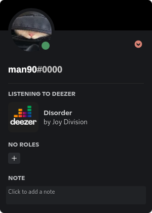

# DeezerCord

> **Warning**
>
> This project is not maintained anymore and will probably stop working sooner or later. It can be used as an example for runtime scraping of dynamic SPA content or in-browser Discord rich presence (which may or may not be against Discord TOS), etc.

Let everyone on Discord see what you're listening to on Deezer with this Google Chrome extension.

## How to use
1. Clone this repository to your local machine
2. Go to [chrome://extensions page](chrome://extensions/) and enable Developer mode
3. Click "Load unpacked" and select your cloned files
5. Log on to [Discord](https://discord.com) in your browser
6. Go to [Deezer.com](https://www.deezer.com/) and start listening to some tunes
